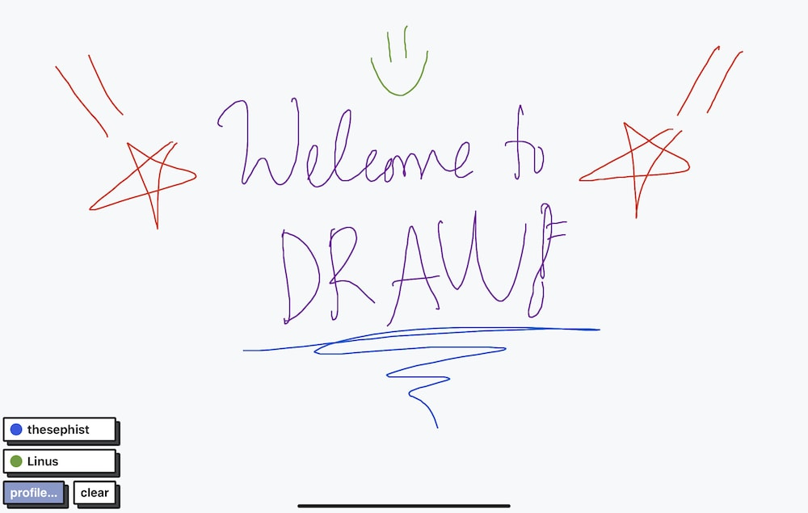

# draw 🖌

draw is a tiny in-memory collaborative whiteboard for the web. draw syncs pen strokes in real-time across all users in the room, as well as managing presence in real-time between all active users to show when users join and leave. I wouldn't call it production-ready, but it works well enough for my personal use cases of doodling with friends, and fits in a few megabytes of RAM.

I usually use it to share drawings and doodle together with friends on iPads with the Apple Pencil, and works quite well even on slow connections and devices.

It's built on...

- [Torus](https://github.com/thesephist/torus) as a light frontend UI library
- [blocks.css](https://thesephist.github.io/blocks.css/) to add some spice to the UI design
- [Gorilla WebSocket](https://github.com/gorilla/websocket) for initiating and managing WebSocket connections, and as a simple web server



## Deploy

Deployment is managed by systemd. Copy the `draw.service` file to `/etc/systemd/system/draw.service` and update:

- replace `draw-user` with your Linux user
- replace `/home/draw-user/draw` with your working directory (path to repository or a copy of `static/`)

Then start draw as a service:

```sh
systemctl daemon-reload # reload systemd script
systemctl start draw   # start draw server as a service
```
